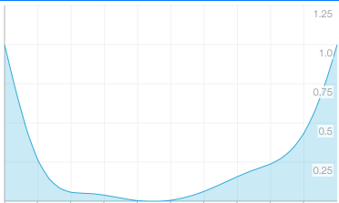
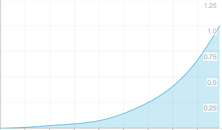

# Comfort

<br />

## Method

1. Get sensor data (Temperature, Humidity, Sound Level) and Location (Latitude, Longitude)
2. [Calculate Heat Index](#calculate_heat_index) from Temperature and Humidity
3. [Evaluate Heat Index](#evaluate_heat_index)
4. [Evaluate Sound Level](#evaluate_sound_level)

<br />


<a name="calculate_heat_index"> </a>
## Calculate Heat Index

### Formula

```
HeatIndex = 0.81 * Temperature + 0.01 * Humidity * (0.99 * Temperature - 14.3) + 46.3
```
Temperature (Celsius), Humidity (%)

<br />


<a name="evaluate_heat_index"> </a>
## Evaluate Heat Index

##### Definition

0.0 is comfortable. 1.0 is uncomfortable.

##### Evaluation Function

Make an evaluation function by using spline curve. Pick some arbitrary points that the curve passes.

### Example

##### Pick some arbitrary points

```
[
    { "heat index": 55.0, "evaluation": 1.00 },
    { "heat index": 57.5, "evaluation": 0.35 },
    { "heat index": 62.5, "evaluation": 0.05 },
    { "heat index": 67.5, "evaluation": 0.00 },
    { "heat index": 72.5, "evaluation": 0.05 },
    { "heat index": 77.5, "evaluation": 0.20 },
    { "heat index": 82.5, "evaluation": 0.50 },
    { "heat index": 85.0, "evaluation": 1.00 }
]
```

##### Make a spline curve from the points



<br />


<a name="evaluate_sound_level"> </a>
## Evaluate Sound Level

##### Definition

0.0 is comfortable. 1.0 is uncomfortable.

##### Evaluation Function

Make an evaluation function by using spline curve. Pick some arbitrary points that the curve passes.

### Example

##### Pick some arbitrary points

```
[
    { "sound level (dB)": 10.0, "evaluation": 0.00 },
    { "sound level (dB)": 20.0, "evaluation": 0.01 },
    { "sound level (dB)": 30.0, "evaluation": 0.03 },
    { "sound level (dB)": 40.0, "evaluation": 0.05 },
    { "sound level (dB)": 50.0, "evaluation": 0.10 },
    { "sound level (dB)": 60.0, "evaluation": 0.20 },
    { "sound level (dB)": 70.0, "evaluation": 0.35 },
    { "sound level (dB)": 80.0, "evaluation": 0.60 },
    { "sound level (dB)": 90.0, "evaluation": 1.00 }
]
```

##### Make a spline curve from the points



<br />


## A rough indication

### Heat Index

> SOURCE: http://keisan.casio.jp/exec/system/1202883065

### Sound Level

| Noise Source | Value | Effect |
|-|-|
|Jet take-off (at 25 meters) | 150 | Eardrum rupture |
|Aircraft carrier deck | 140 |   |
|Military jet aircraft take-off from aircraft carrier with afterburner at 50 ft (130 dB). | 130 |   |
|Thunderclap, chain saw. Oxygen torch (121 dB). | 120 | Painful. 32 times as loud as 70 dB. |
|Steel mill, auto horn at 1 meter. Turbo-fan aircraft at takeoff power at 200 ft (118 dB). Riveting machine (110 dB); live rock music (108 - 114 dB). | 110 | Average human pain threshold. 16 times as loud as 70 dB. |
|Jet take-off (at 305 meters), use of outboard motor, power lawn mower, motorcycle, farm tractor, jackhammer, garbage truck. Boeing 707 or DC-8 aircraft at one nautical mile (6080 ft) before landing (106 dB); jet flyover at 1000 feet (103 dB); Bell J-2A helicopter at 100 ft (100 dB). | 100 | 8 times as loud as 70 dB. Serious damage possible in 8 hr exposure |
|Boeing 737 or DC-9 aircraft at one nautical mile (6080 ft) before landing (97 dB); power mower (96 dB); motorcycle at 25 ft (90 dB). Newspaper press (97 dB). | 90 | 4 times as loud as 70 dB. Likely damage 8 hr exp |
|Garbage disposal, dishwasher, average factory, freight train (at 15 meters). Car wash at 20 ft (89 dB); propeller plane flyover at 1000 ft (88 dB); diesel truck 40 mph at 50 ft (84 dB); diesel train at 45 mph at 100 ft (83 dB). Food blender (88 dB); milling machine (85 dB); garbage disposal (80 dB). | 80 | 2 times as loud as 70 dB. Possible damage in 8 hr exposure. |
|Passenger car at 65 mph at 25 ft (77 dB); freeway at 50 ft from pavement edge 10 a.m. (76 dB). Living room music (76 dB); radio or TV-audio, vacuum cleaner (70 dB). | 70 | Arbitrary base of comparison. Upper 70s are annoyingly loud to some people. |
|Conversation in restaurant, office, background music, Air conditioning unit at 100 ft | 60 | Half as loud as 70 dB. Fairly quiet |
|Quiet suburb, conversation at home. Large electrical transformers at 100 ft | 50 | One-fourth as loud as 70 dB. |
|Library, bird calls (44 dB); lowest limit of urban ambient sound | 40 | One-eighth as loud as 70 dB. |
|Quiet rural area | 30 | One-sixteenth as loud as 70 dB. Very Quiet |
|Whisper, rustling leaves | 20 |   |
|Breathing | 10 | Barely audible |  | 

> SOURCES: Temple University Department of Civil/Environmental Engineering (www.temple.edu/departments/CETP/environ10.html), and Federal Agency Review of Selected Airport Noise Analysis Issues, Federal Interagency Committee on Noise (August 1992). Source of the information is attributed to Outdoor Noise and the Metropolitan Environment, M.C. Branch et al., Department of City Planning, City of Los Angeles, 1970.
